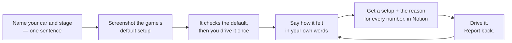
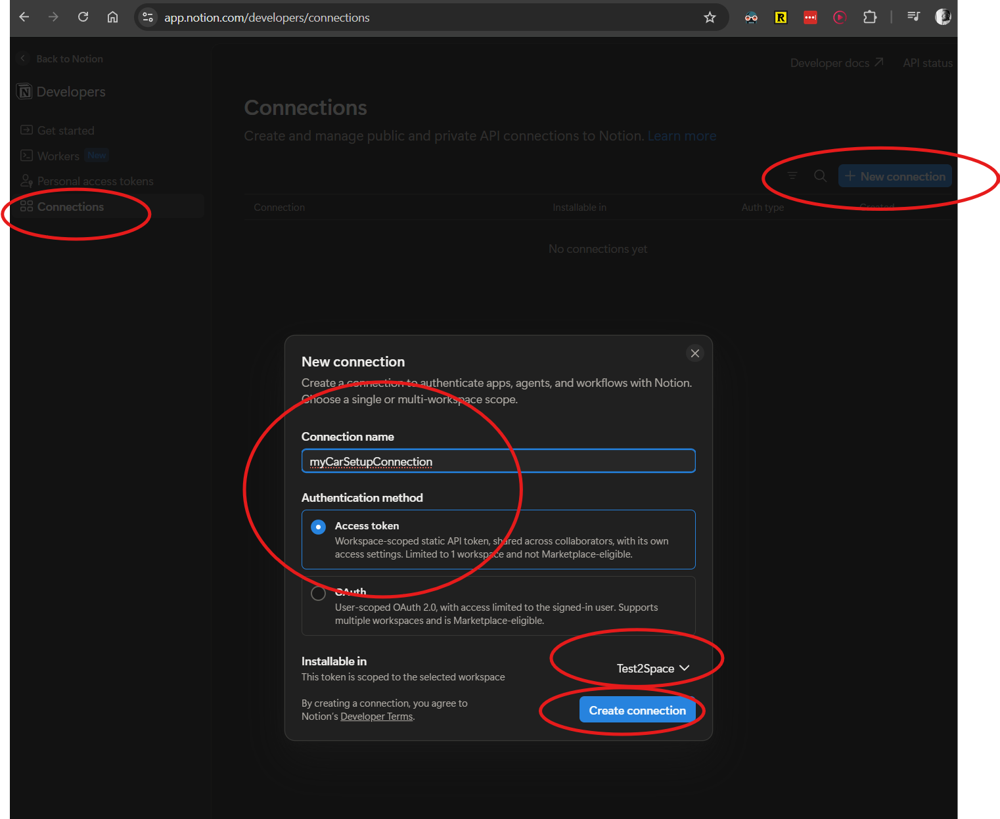
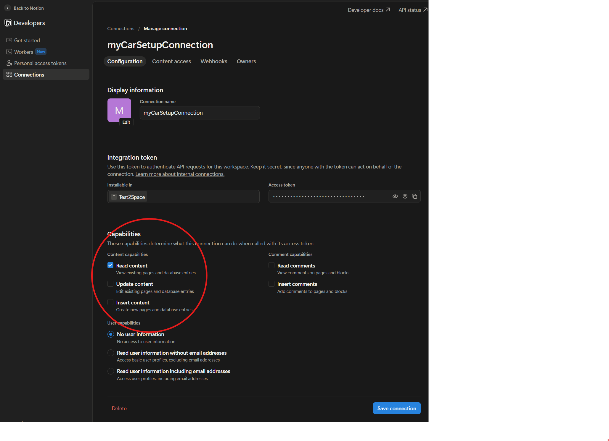
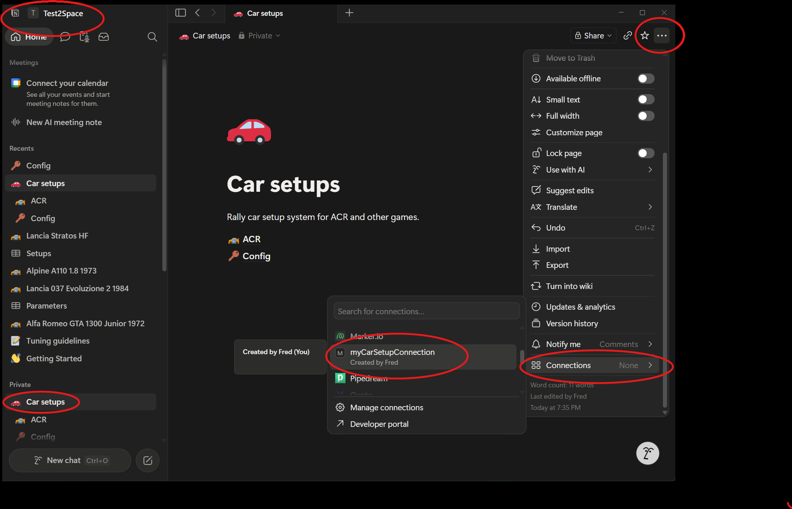
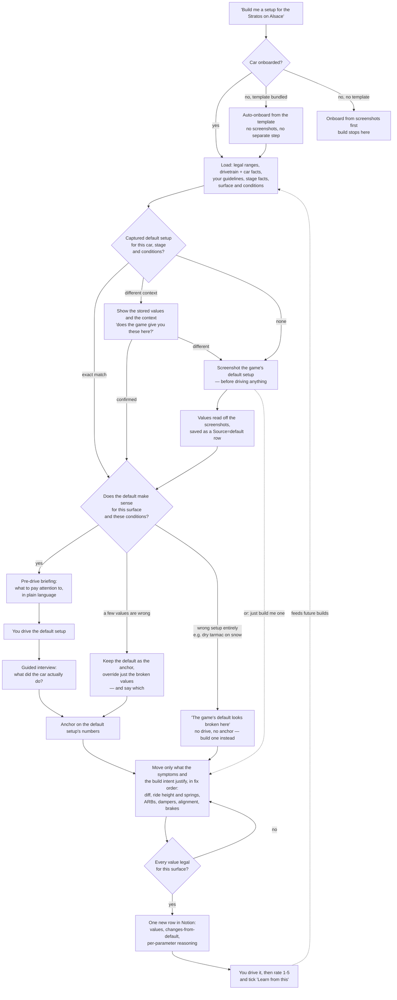
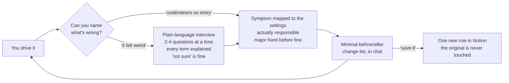
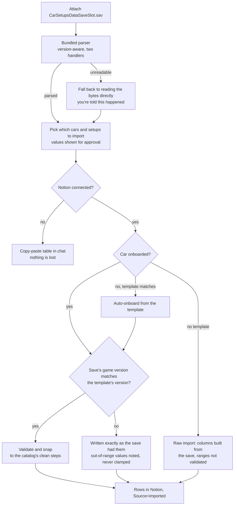
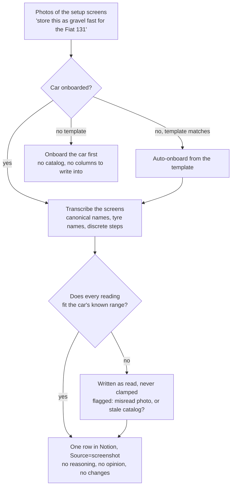
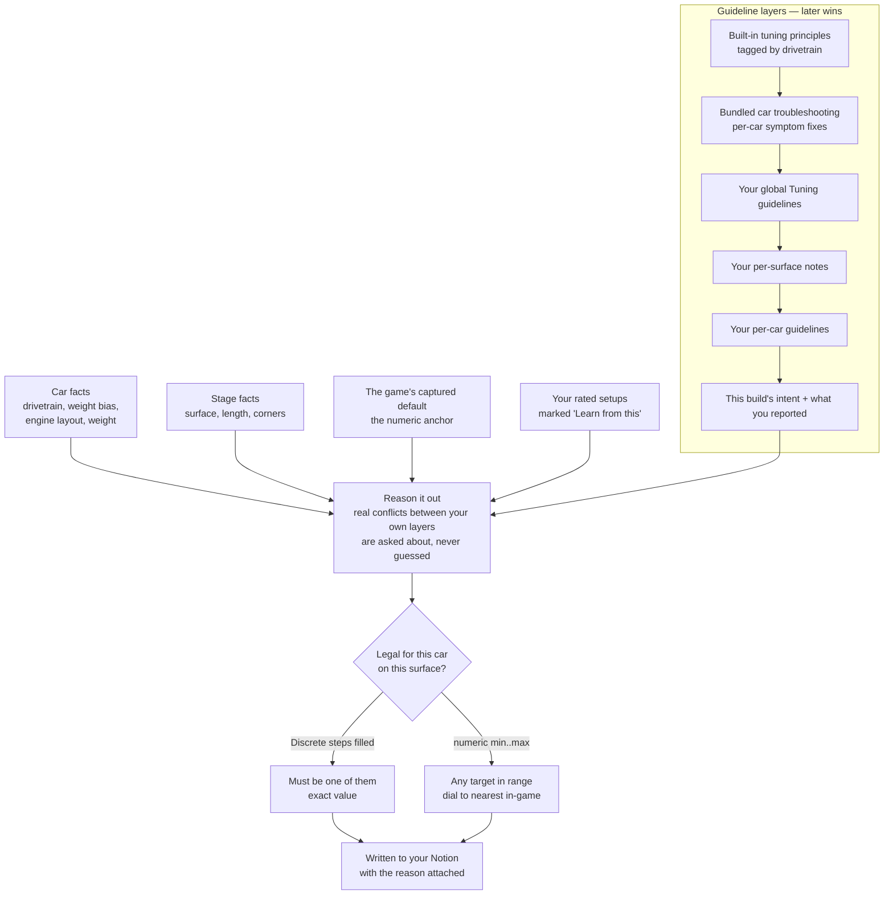

# ACR Setup Engineer

**Turns Claude into your own rally setup mechanic — for Assetto Corsa Rally.**

You describe what the car did. In your own words. It works out which setting is doing it,
changes it, tells you why, and saves the whole thing to your phone.

Free. Open source. Your data stays in your Notion.

> **▶ Video walkthroughs:**
> - [Installation](https://www.youtube.com/watch?v=f7NPJM9S9PU)
> - [Onboarding a new (unsupported) car](https://www.youtube.com/watch?v=6EULzBKqBRc)

---

## Forty sliders, six ways to fix the same thing

You open **Car Setup** for the first time and there are forty-odd sliders staring back at you.
Twenty if you are in something from 1972. Nearly fifty in a Delta Integrale.

Ramp angles. Preload. Plates. Bump and rebound — slow *and* fast. Adjuster ring. Toe.

There are explanations. That's not the problem. The problem is that understeer alone has about nine plausible causes — front ARB, diff preload, ride height, rebound, toe — and the screen doesn't rank them. Every knob is presented as equally likely.

Knowing what a slider does isn't the same as knowing which one to move. That gap is years of trial and error, and most people never close it. So you drive the default forever, or you paste a stranger's numbers off a forum and hope.

Meanwhile the car keeps doing the thing you hate.

It pushes wide when you turn in. It spins the inside wheel out of every hairpin. It skips off line on the rough stuff and you're just a passenger.

**You already know what's wrong. You just don't know which slider owns it.**

That's the entire problem this fixes.

## "I'd be faster if the setup wasn't holding me back"

If you've thought that, you're probably right.

You're not losing that corner because you can't drive it. You're losing it because the car won't
rotate on the way in, and the fix is one setting you've never heard of, three menus deep.

That's the frustrating part. It isn't a talent gap. It's a **vocabulary gap** — and it costs you
the same seconds every single run.

Setup work is the cheapest speed in the game. No new wheel, no new pedals, no extra seat time.
Everyone at the sharp end is already tuning their way out of problems you're still driving around.

You don't need to become a race engineer to close that. You need something that turns *"the back
steps out on every hairpin"* into the two settings actually responsible.
## The fast guy's setup was built around the fast guy

The usual shortcut is to copy a setup off YouTube or a Discord from someone quick, drop it in, and
find out you're *slower*. That's not bad luck.

A fast driver's setup is built around a fast driver. It's usually pointier and looser than you'd
want, because he's happy with a car that rotates hard and he catches it without thinking. It's built
for his braking points, his line, his commitment over crests, his stage, his conditions. Hand that
car to someone driving at a different pace and it isn't fast — it's just harder.

And the worse part is you learn nothing. You've got forty numbers you didn't choose, so when the
car does something you hate you have no idea which one did it, or whether it was ever the setup at
all.

Copy the fast guy by all means — but as a **starting reference you can interrogate**, not as
gospel. Point this at his setup, say what you don't like about it, and it'll tell you which of his
numbers is fighting you and pull it back toward how *you* drive.


## How it works, in one picture



No files to edit. No numbers to look up. You talk, it engineers.

## What you actually get

**You never have to know the words.**
*"It felt weird, I don't really know what was wrong"* is a perfectly good answer. It interviews
you instead — in plain English. *"Did the car want to run wide when you turned in — and was that
as you turned, or once you were already round?"* *"Did one wheel spin up out of the hairpins, or
did the whole back end step out?"* Every term gets explained the moment it comes up, and **"not
sure" is always allowed.**

**It starts from the default setup — not from nowhere.**
Before it builds anything, it asks for a screenshot of the game's default setup and reads its
numbers. Every change after that is a deliberate move away from a known reference — not a guess
dressed up as engineering. Then it tells you to drive that default once, and tells you *what to pay
attention to before you go* so you know what you're feeling for.

**And it won't send you out on a default the game got wrong.**
ACR sometimes offers a setup from the wrong regime entirely — dry tarmac tyres for the same stage in
snow. It checks the default before you drive it: if it's sensible, off you go. If it isn't, it says
so, tells you what's wrong with it, and builds you a proper one instead of wasting your run.

**It fixes the big thing first.**
Nothing is more useless than fine-tuning your dampers while the differential is wrong. It works a
fixed order — the differential first, then ride height and springs, then anti-roll bars, then
dampers, then wheel angles, then brakes — so each run tells you something. Your own words always
outrank the order.

**It cannot hand you an illegal number.**
Your car's real limits get captured once, straight from the game. Every value it writes is inside
them, by construction. It will never invent a setting your car doesn't have, or a number the game
won't accept.

**Every number comes with a reason — readable on your phone, mid-session.**
The setup lands in your Notion as a row you can read one-handed while the stage loads. Underneath
it: what changed from the game's default, and why each one moved.

**It gets more *yours* the more you use it.**
Rate a setup 1–5 after driving. Tick *"Learn from this"* on the ones you loved. Future setups follow
your taste — not the internet's.

**Your own setups belong in there too.**
Tinkered your way to something good in-game? Photograph the setup screens, attach them, name it —
it's in Notion. No rebuilding it by hand, no explaining yourself. It transcribes what you built and
keeps its opinions to itself.

**Your existing setups can't be lost.**
Game update wiped your saves? Attach your `.sav` file and it pulls every setup you'd already built
straight into Notion. It reads older save formats too.

## You don't have to be building a setup to use it

Half of what I use it for isn't building anything. It's thinking out loud.

Setup work is normally a lonely business. You get a theory, there's nobody to test it against, and
the only way to find out is to burn a run on it. That's the real bottleneck — not the sliders, the
thinking.

And there's no such thing as a free change. Everything in a setup is a tradeoff — you get more of
this, you get less of that. Every slider is buying something with something else, and the screen
won't tell you what you're spending.

So talk to it *before* you touch anything:

- *"I want more rotation on turn-in but I don't want it loose over crests. What are my options and
  what does each one cost me?"*
- *"Stiffer rear bar or less preload — what's the difference in how it'll actually feel?"*
- *"Wales, wet, third gear the whole way. What should I be worried about before I start?"*
- *"My Alsace setup works and I don't know why. Explain it to me."*
- *"What does preload actually do?"*

You get the tradeoff, not just an answer — and you can argue with it, which is the point. It's
read-only while you're talking: nothing gets written to your Notion until you say save.

Some of the best sessions end with you changing nothing. Working out *why* the car does what it
does is worth as much as the setup — and sometimes the honest answer is that the car's fine and you
should go drive it.

## You can't break anything

- **It never overwrites a setup.** Every save is a new row. The original is untouched, always.
- **Everything lives in your Notion**, in plain tables you own. Delete the skill tomorrow and your
  setups are still sitting there.
- **The token it uses to read your data is read-only**, and only sees the one page you connect it
  to. It cannot modify or delete anything, anywhere.
- **It's free**, and it works on Claude's free plan.

## Get your first setup in about ten minutes

1. Install the skill (5 minutes, one-time — [full steps below](#installation-one-time-about-5-minutes),
   or [watch it](https://www.youtube.com/watch?v=f7NPJM9S9PU)).
2. Say: *"Onboard the Lancia Stratos HF for Assetto Corsa Rally."* If it's one of the
   [18 bundled cars](#bundled-car-library), that's it — no screenshots, no typing.
3. Say: *"Build me a setup for a fast, bumpy tarmac stage."*
4. Drive it. Come back and say how it felt — even badly.
5. Iterate until you like it, then say *"save it."*

## Already know your way around a setup screen?

It doesn't get in your way, and there's plenty here for you:

- **Point it at an existing setup as a starting basis** — including one from a *different car*,
  where it transfers the *feel* rather than the raw numbers and re-derives every value for the new
  car's weight bias, drivetrain and surface.
- **Pin any parameter to its exact in-game click values** so it stops picking "somewhere in range"
  ([Discrete steps](#pinning-a-setting-to-exact-values)).
- **Write your own tuning rules** in Notion — global, per-surface, and per-car. Your guidelines beat
  the built-in ones, and it cites which one drove each choice.
- **Surface-aware ranges** — several cars expose different suspension limits on gravel than on
  tarmac, and it validates against the right ones.
- **Review any setup** like a rally mechanic would before the stage: is it right for this road and for you?
- **Share a setup** as a clean copy-paste block for Discord.
- **Export a car** as a YAML template and contribute it back so the next driver skips the
  screenshots.

## Honest caveats

- **Assetto Corsa Rally is in early access.** Tyres, physics and settings shift between builds.
  Treat every setup as a strong, reasoned starting point — verify in-game.
- **The game's toe sign is inverted** (an ACR bug): a **positive** toe value in the setup screen
  actually points the wheels **outwards** (toe-out), a negative one points them inwards (toe-in).
  The skill knows this — it picks toe with the inversion in mind, gives you the number to type in
  as-is, and reminds you of it every time it hands you toe values. Enter them exactly as given;
  don't flip the sign yourself.
- **This won't make you fast on its own.** It removes the guessing from setup work. The driving is
  still yours.
- **It needs Notion** for the full experience (free account is fine). Save-file recovery works
  without it.
- **Claude's Free plan runs a reduced mode** — every car works fully, but it can't read your
  saved setups back, so it can't learn from them. Details in
  [What Claude's Free plan can't do](#what-claudes-free-plan-cant-do).
- The skill is free; running Claude heavily may not be.

---
---

# Technical documentation

## What it is

A self-contained **Claude Skill** covering the **whole lifecycle of a car setup** for Assetto Corsa
Rally: onboard a car, capture the game's baseline, build, tweak, review, explain, share, import and
export. All state lives in the user's **Notion**, resolved by name — the skill creates its own
structure on first use and stores no IDs.

Two channels talk to Notion on purpose: **writes** go through the claude.ai Notion connector,
**reads** go through Notion's REST API with a read-only token (see
[How it reads and writes Notion](#how-it-reads-and-writes-notion)).

## Prerequisites

- A **Claude account** at [claude.ai](https://claude.ai). Works on **Free**, with limits — see
  [What Claude's Free plan can't do](#what-claudes-free-plan-cant-do); **Pro** removes them and
  has more headroom for the longer workflows.
- A **Notion account** (free is fine). All setups live there.

## Installation (one time, about 5 minutes)

> **▶ Watch it instead:** [Installation walkthrough](https://www.youtube.com/watch?v=f7NPJM9S9PU)

1. **Connect Notion.** claude.ai → **Settings → Connectors** → add **Notion** and authorize it.
   Available on every plan.
2. **Enable code execution, Skills, and network.** Settings → **Capabilities** → turn on **Code
   execution** and **Skills**. Then set **Network egress** to **All domains** — the skill calls
   Notion's API from the code sandbox and can't reach it otherwise. Settings apply to **new chats
   only** — if one is already open, start another.
   **On the Free plan the "All domains" option doesn't exist** — egress stops at package managers,
   and no setting changes that. The skill still works, and every car works fully; only your saved
   setups can't be read back (see
   [What Claude's Free plan can't do](#what-claudes-free-plan-cant-do)).
3. **Add the skill.** Download **`acr-setup-engineer-skill-vX.Y.Z.zip`** (the latest version) from
   [Releases](../../releases). claude.ai → Settings → **Customize → Skills → Add skill** →
   upload the ZIP.
4. **Onboard your first car.** New chat: *"Onboard the Lancia Stratos HF for Assetto Corsa
   Rally."* This creates the whole Notion structure on first use.
5. **Give the skill read access to Notion** (below) — 3 minutes, and reads become fast and
   exact. **Skip this on Free** — the token feeds a read path Free can't run (see
   [What Claude's Free plan can't do](#what-claudes-free-plan-cant-do)).

### The read-only Notion token

The skill reads your **setup history** through Notion's **REST API**, because the connector can't
reliably list a database's rows. That needs a token.

1. **Create a read-only connection.** Go to
   [notion.so/profile/integrations](https://www.notion.so/profile/integrations) → **Connections** →
   **+ New connection**. Name it (e.g. `myCarSetupConnection`), leave **Authentication method** on
   **Access token**, pick your workspace, **Create connection**.
   On its **Configuration** tab under **Capabilities**, leave **only "Read content"** checked
   (uncheck Update and Insert) and **Save**. Copy the token (`secret_…` / `ntn_…`).

   

   

2. **Connect it to only your data.** Open your **ACR Setup Engineer** page in Notion → **•••** →
   **Connections** → add the connection you just made. Access cascades to everything under it —
   **and nothing else** in your workspace.

   

   *(The screenshot predates a rename — your root page is called **ACR Setup Engineer**.)*

3. **Give the skill the token** (pick one):
   - **Store it (recommended).** The skill auto-creates a **`Config`** page under **ACR Setup
     Engineer** (with these steps already on it) the first time it builds your structure. Paste the
     token there. It's read automatically in every chat afterwards. Safe: the token is read-only and
     only unlocks the data it sits next to.
   - **Paste per chat.** Nothing is stored; paste it when asked.

## Quick start by task

### Onboard a car

> **▶ Watch it instead:** [Onboarding a new car](https://www.youtube.com/watch?v=6EULzBKqBRc)

*"Onboard the Lancia Stratos HF for Assetto Corsa Rally."*

- **Bundled template?** It offers to set the car up from it — no screenshots. The template stays
  inside the skill and **is** the car's parameter list, so Notion gets the setup columns and the
  car's pages. Nothing to fill in, nothing to keep in sync, and it works on every plan without a
  token or a network connection. To see the values, ask in chat: *"show me the Stratos' parameter
  list"*.
- **Otherwise:** two full passes of the Car Setup screens (everything at **minimum**, then
  everything at **maximum**), attached in chat. It reads every setting's range off the images.
  **Take this first pass on a tarmac stage (e.g. Alsace)** — that's the baseline.
- **Plus one shot of the car information / HISTORY screen** — the page with the car's class
  badges, `Engine`, `Max Power`, `Max Torque`, `Weight` and the drivetrain / gearbox /
  steering-lock icons. Optional, but it settles most of the car's facts in a single image.
  A car set up this way keeps its parameter list on a **`Parameters`** page under the car in your
  Notion. To change a value in it, say so in chat — *"the {car}'s front anti-roll bar goes 1 to 6
  in steps of 1"* — and the skill checks it and updates the page.

Each car's Notion page says which of the two it used, on a **`Catalog source:`** line: the
bundled template and its game version, or your screenshots and the game version you gave.

It records the car's **drivetrain, engine layout, weight bias, weight, max power, max torque,
class, gearbox and steering lock** on its Notion page, to inform balance reasoning. Most come
straight off that info screenshot; anything it doesn't show — weight bias never appears there — it
looks up online. **You only get asked as a last resort**, once, for whatever is genuinely
unfindable, and "don't know" is always a fine answer. All nine are editable on the car's Notion
page afterwards.

**Cars with a bundled template also get a chart and a link** on their Notion page, both read
straight out of the ACR game files — so they're what the car actually does in the sim, not
brochure figures:

- a **power/torque chart** — the engine curve;
- a link to the car's page in the **ACR Car Lab** (`https://fredmayor88.github.io/acr-car-lab/`) —
  an interactive tool showing every gear set, final drive and shift point, computed from the game
  files, with the speed readings checked against in-game runs.

The same data drives gearing advice in numbers: peak torque rpm, peak power rpm, and the whole
curve between them. On turbocharged cars the curve's peak torque often
sits below the `Max Torque` the info screen quotes; both are kept, and the skill tells you which is
which.

Onboarded a car before the gearing tool link existed? Say *"refresh the Lancia Stratos in my
Notion"* and it brings everything static about the car up to date — the chart, the link and the
identity facts — without touching your setups.

A refresh does not change a car's parameter list. To change it, say the change in chat (see
[Change a car's parameter list](#change-a-cars-parameter-list)). (One exception: a car you
onboarded from screenshots switches to a bundled list when a newer one ships — the refresh tells
you.)

**If you onboarded a car with an older version of the skill**, its parameter list may still be
rows in a `Parameters` table under the root. The first refresh of that car — or the next time the
skill needs its list — moves it onto the car's own `Parameters` page and tells you the table can
be deleted. Nothing is deleted for you.

A car you onboarded from your own screenshots keeps its own list — until a refresh finds a bundled
template for that car:

- **The template is for the same game version as your screenshots, or a newer one** → the car
  switches to the template, and the refresh tells you so. Your own list stays on its `Parameters`
  page, not in use. To go back, say *"onboard the {car} from my screenshots"*.
- **Your screenshots are from a newer game version** → the car keeps your screenshots, and the
  refresh offers to send your capture back to the project as a template.
- **You didn't give a game version when you took the screenshots** → it asks once. If you're not
  sure, say yes.

**Contributing it back.** If your car had no bundled template, you've just built its catalog by
hand — and you're the only person who can hand it to the next driver of that car. So at the end it
offers to turn your catalog into a shareable template (paste it into a form on GitHub, free
account, nothing to install). If any parameters are still flagged as needing your input, it waits
and simply
tells you that once you've filled them in, *"contribute my car"* will do it. Always optional, never
nagged.

**Gravel ranges.** On many cars a few suspension settings — usually spring stiffness — expose a
*different* range on gravel. After the tarmac pass it asks you to load a gravel stage (e.g. Wales),
open **Suspensions**, and say whether the range differs. If it does, you take a second full min/max
pass on gravel and it records the gravel-only ranges separately. If not, tarmac ranges apply
everywhere. Snow inherits gravel's ranges — no separate snow pass.

### Build a setup

Tell it the car, the stage (optional), and how you like to drive:

> *"Build a setup for the Lancia Stratos on a fast, bumpy tarmac stage; I like gentle throttle-on
> rotation and hate a floaty car under braking."*

The first time you mention a stage, its facts (surface, length, key corners) are saved once to a
shared catalogue — every later setup, for any car, references the same stage without re-describing
it.

**Name the real stage and you can have it researched for you.** If you give it the actual stage
name rather than a vague description, you can ask it to **look the stage up online** — surface,
length, elevation change, how tight or flowing it is, what the corners are like. Those facts land
in the catalogue once and sharpen every setup built for that stage afterwards. Don't know the
name, or would rather not bother? Describe it in a sentence; that works fine too.

**The first run on a new car/stage starts with the default setup** — screenshot it, and it gets
captured, checked, and (if it holds up) driven before anything is built; see the flow below. It's a
strong recommendation, never a gate: say *"just build me one"* and it will, noting that no baseline
anchor was used.

### Tweak a setup

After driving, describe what felt wrong: *"The Alsace setup understeers on entry — can you soften
the front bar?"* It maps the feedback to specific parameters and proposes a minimal before/after
change list **in chat**. Nothing is written while you iterate. When you're happy and **ask it to
save**, it creates one new row based on the original — the source is never modified.

Can't describe it? Say so, and it runs the guided interview instead.

### Review a setup

*"Review my alsace dry fast setup."* It reads the setup the way a rally mechanic would at the
service park before the stage. First a verdict: *ready to go*, *fix these first*, or *wrong setup
for this stage*. Then what the stage asks of the car (hairpins, jumps, bumps, braking zones, grip)
and how this setup copes with each, and the few changes it would make before the start, each with
an exact value and a plain reason. It also reads what you've told it after earlier drives (the
car's `Log`) and says when a change would go against one of your guidelines. Values the game
wouldn't accept are always listed first. The review is printed in chat and added as a timestamped
**AI Review** section on the setup's Notion page. If the setup has no stage, it asks for one.

### Ask a question

*"What's the impact of a stiffer front ARB?"* · *"Why is the ride height so high on my Wales
setup?"* · *"What's different between these two setups?"* Read-only: it explains, never writes.

### Save a setup you built yourself

You've been tinkering in-game and you like where it ended up. Photograph the setup screens with
your phone, attach them, and say *"store this as 'gravel fast' for the Fiat 131."* It transcribes
the screens into a Notion row and stops there.

It doesn't judge the setup, doesn't improve it, doesn't ask you why. You built it — the screens are
the truth. The only thing it checks is whether it read the photos correctly, and it only says
anything if a number looks impossible.

### Import setups from your save file

Attach `CarSetupsDataSaveSlot.sav` (Windows:
`%LOCALAPPDATA%\acr\Saved\SaveGames\CarSetupsDataSaveSlot.sav`) and say *"Import my setups from
this save."* It shows what it found, asks which cars/setups you want, and writes them to Notion.

Works **without Notion** (you get a copy-paste table in chat) and **without onboarding the car
first** (imported anyway; onboard later for the full experience). Older save versions are handled
by a tolerant parser.

### Share a setup

*"Share my alsace dry fast setup."* → a clean, copy-paste-ready block for Discord, WhatsApp,
forums.

### Export a car template

*"Export a template for the Lancia Stratos."* → a YAML file plus a one-click share link. You sign
in to GitHub, paste it into the submission form, press Create. No fork, no pull request, no command
line, no tokens.

### Change a car's parameter list

*"The Lancia Stratos' front anti-roll bar goes 1 to 6 in steps of 1."* It checks the change and
updates the car's list. For a bundled car this makes a copy of the list under the car, with your
change — the skill says so in one line. If that car still has an older list of its own on its
`Parameters` page, the skill asks before replacing it.

### After you update the skill

*"Refresh my ACR Notion."* One command brings everything the skill keeps in your Notion up to date
with the version you installed: the `How to use`, `Claude Free plan` and `Parameter reference`
pages, and every car's pages (their facts, chart and gearing link). It never changes a car's
parameter list, your setups, your `Tuning guidelines`, a car's `Guidelines` or your notes on a
car's `Log`. To update
a single car, say *"refresh the Lancia Stratos in my Notion"*.

You don't have to remember this: the first time you use the skill after an update, it rewrites
`How to use` on its own and reminds you once.

## The workflows

| You want to… | Workflow |
|---|---|
| Capture a car's tunable parameters | [`onboard-car.md`](.claude/skills/acr-setup-engineer/references/onboard-car.md) |
| Build a setup for a stage | [`build-setup.md`](.claude/skills/acr-setup-engineer/references/build-setup.md) |
| Refine on driving feedback | [`tweak-setup.md`](.claude/skills/acr-setup-engineer/references/tweak-setup.md) |
| Work out what's actually wrong | [`driving-feedback-interview.md`](.claude/skills/acr-setup-engineer/references/driving-feedback-interview.md) |
| Review a setup like a rally mechanic | [`review-setup.md`](.claude/skills/acr-setup-engineer/references/review-setup.md) |
| Explain a setup or a concept | [`ask-setups.md`](.claude/skills/acr-setup-engineer/references/ask-setups.md) |
| Produce a copy-paste snippet | [`share-setup.md`](.claude/skills/acr-setup-engineer/references/share-setup.md) |
| Save a setup you built in-game, from photos | [`capture-setup.md`](.claude/skills/acr-setup-engineer/references/capture-setup.md) |
| Import from a save file | [`import-savegame.md`](.claude/skills/acr-setup-engineer/references/import-savegame.md) |
| Export a community template | [`export-car-template.md`](.claude/skills/acr-setup-engineer/references/export-car-template.md) |
| Change a car's parameter list | [`edit-catalog.md`](.claude/skills/acr-setup-engineer/references/edit-catalog.md) |
| Refresh everything after an update | [`refresh-notion.md`](.claude/skills/acr-setup-engineer/references/refresh-notion.md) |

## Flows

### Building a setup (baseline-first)



### The refine loop

Nothing is written to Notion while you iterate. One row at the end, only when you ask.



### Onboarding a car

```mermaid
flowchart TD
    Req["'Onboard the Lancia Stratos HF'"] --> Tpl{"Bundled template<br/>for this car?"}

    Tpl -->|"yes"| Offer["Offer it: all ranges and<br/>discrete steps pre-filled"]
    Offer -->|"accepted"| Facts
    Offer -->|"declined"| Shots
    Tpl -->|"no"| Shots["Attach two full passes of the<br/>Car Setup screens: everything at min,<br/>then everything at max<br/>TARMAC stage — this is the baseline<br/>+ one shot of the car info screen"]

    Shots --> Extract["Read every row: section, name,<br/>min, max, unit, screen order"]
    Extract --> Confirm["Confirmation table<br/>uncertain reads flagged"]
    Confirm --> Facts["Car identity facts, per field:<br/>info screenshot → template →<br/>model knowledge → web lookup →<br/>ask you (last resort)"]

    Facts --> Notion["Create/extend the Notion structure<br/>setup value columns + all nine identity facts<br/>+ the catalog source line, the chart and the gearing-tool link<br/>+ a Parameters page holding the car's list ONLY when it came from screenshots<br/>(a template car's parameters stay in the skill)"]
    Notion --> Gravel{"Screenshot onboard: do any<br/>suspension ranges differ on gravel?"}

    Gravel -->|"no / skip / template car"| Done["Ready. Tarmac ranges<br/>apply everywhere"]
    Gravel -->|"yes"| Second["Second full min/max pass on gravel"]
    Second --> Diff["Auto-diff vs tarmac, confirm,<br/>write Surface=Gravel rows<br/>only for what differs"]
    Diff --> Done

    Done --> Contrib{"Built from screenshots?<br/>i.e. no bundled template existed"}
    Contrib -->|"no"| End["Onboarded"]
    Contrib -->|"yes"| Share["Offer to contribute it as a<br/>community template<br/>(once any flagged gaps are filled)"]
    Share --> End
```



### Importing from a save file



### Capturing a setup from photos



### How one value gets decided



## What it creates in Notion

Created on first use, resolved **by name** (no stored IDs), self-healing if you rename or move
things back:

```
ACR Setup Engineer (root page)
├── How to use              what you can ask for, what to run after an update, which page is
│                            whose. The skill's page: rewritten on every update
├── Claude Free plan        what works and what doesn't on Claude's Free plan. The skill's
│                            page: rewritten on every update
├── Config                  read-only API token + its setup instructions
├── Setups           (DB)   one row per setup
├── Tuning guidelines       your global preferences (editable)
├── Parameter reference     the in-game description of every parameter (auto-maintained)
├── Locations
│   └── {Location}
│       └── {Stage}         facts only: surface, length, key corners, character
└── {Car}                   e.g. "Lancia Stratos HF" — an empty umbrella page holding four
                             pages, or five for a car you onboarded from screenshots:
    ├── Guidelines          YOURS. Your tuning notes for this car. The skill reads it
    │                        and never writes to it.
    ├── Catalog             Drivetrain, weight bias, engine layout, weight, where this car's
    │                        parameter list comes from, the power/torque chart and a link to
    │                        the ACR Car Lab gearing page. Rebuilt on every refresh.
    ├── Log                 SHARED. Your own notes about this car, anywhere on the page,
    │                        plus what you told Claude about how a drive felt, dated.
    │                        Building a setup adds nothing here.
    │                        Yours are yours to edit; the skill only ever adds — it never
    │                        edits or deletes anything on this page.
    ├── Parameters          only for cars onboarded from screenshots (or edited away from a
    │                        bundled template): the car's complete parameter list. Kept by
    │                        the skill. To change it, say the change in chat
    └── Setups              a filtered view of your setups for this car
```

**Why five pages?** (Four for a car that came from a bundled template.) So the skill never has to
guess which words on a page are yours. `Catalog` is regenerated wholesale whenever you refresh a
car — no comparing, no questions, no risk of it clobbering something you wrote — precisely because
everything you write lives in `Guidelines`, which it only ever reads. `Log` is the opposite kind of
page: you and the skill both write on it, but the skill only ever *adds* — it puts a dated entry at
the top each time you tell it how a drive felt, and never edits or removes anything already there,
yours or its own. Building a setup does not add an entry: the reasoning behind a new setup is on
its own row in `Setups`, in the `Notes` column and inside the row's page. So an empty `Log` right
after your first build is normal. Write whatever you want on it: notes about the car, reminders,
things to try. A car you onboarded from screenshots gets a fifth, `Parameters`, holding its
parameter list as a file; the skill writes it and you change it through chat, so there's never a
table to keep in sync. (`Log` used to be called `Feedback`. Say *"refresh the {car} in my Notion"*
and the existing page is renamed for you, with everything on it kept.)

`Setups` is the only database. Car, location and stage pages are **filtered linked views**, never
new databases — a stage is shared reference data, created once and referenced by any number of
setups across any cars.

`Setups` rows are **append-only**. Nothing is ever modified or deleted by the skill.

## Pinning a setting to exact values

Onboarding records each setting's **minimum and maximum**. For a continuous setting that's enough —
it picks a target in range and tells you to dial to the nearest click in-game.

But some settings only offer a **few exact values** (spring stiffness with 4–5 steps), and some are
**named options** with no min/max (gear set, brake caliper type). Those live in the setting's
**`Discrete steps`** list — comma-separated, e.g. `42300, 50000, 57700, 65400, 73100` or
`Short, Medium, Long`. When a setting has steps, every setup picks **only** from those values. A
setting with no steps stays continuous.

For a car you onboarded from screenshots, onboarding pre-seeds `Discrete steps` with what the
screenshots show (usually the two endpoints). Add the in-between options by saying them: *"the
{car}'s spring stiffness front steps are 35000, 42500, 50000"*. Tyre compounds and brake pads
(`SOFT, MEDIUM, HARD`) ship fully pre-filled. **A car from a bundled template needs none of this**:
its exact values are read out of the game files and ship complete in the template.

Onboarding flags the settings most likely to need this: spring stiffness, anti-roll bars, and the
damper channels.

> **Brake parameters.** A created setup may not include values for every brake parameter — some
> aren't always captured during onboarding. For a car you onboarded from screenshots, say them in
> chat and they're added to the car's list.

## Making it tune to your taste

The skill reasons from built-in tuning knowledge **plus your own preferences**, and **your
preferences win**. Edit them in Notion — no files, no code:

- a global **`Tuning guidelines`** page (overall style, likes/dislikes, per-surface notes)
- a **"Guidelines"** section on each car's page for car-specific quirks

Future setups follow whatever you write there, and cite it when it drives a choice.

Ratings feed the same loop: set a **Rating** (1–5), add **Notes**, and tick **Learn from this** on
setups you liked. Only ticked setups enter the learning pool.

## Bundled car library

Templates carry every parameter with min/max ranges, discrete steps and screen order pre-filled, so
these cars onboard in one command — no screenshots:

- **Alfa Romeo GTA 1300 Junior** (1972) — RWD
- **Alpine A110 1.8** (1973) — RWD
- **Audi Quattro Gr.4** (1981) — AWD
- **Citroën Xsara WRC** (2003) — AWD
- **Fiat 124 Abarth Rally 16V** (1974) — RWD
- **Fiat 131 Abarth** (1976) — RWD
- **Hyundai i20 Rally2** (2021) — AWD
- **Lancia 037 Evoluzione 2** (1984) — RWD
- **Lancia Delta Integrale Evoluzione** (1992) — AWD
- **Lancia Fulvia Coupé HF** (1970) — FWD
- **Lancia Stratos HF** (1976) — RWD
- **Mini Cooper S** (1964) — FWD
- **Peugeot 206 WRC** (1999) — AWD (no power/torque chart; its gearing page exists)
- **Peugeot 208 Rally4** (2020) — FWD
- **Peugeot 306 II Maxi** (1997) — FWD
- **Skoda Fabia RS Rally2** (2022) — AWD
- **Subaru Impreza 555 (S3)** (1993) — AWD
- **Volkswagen Polo GTI R5** (2018) — AWD

Every bundled template is extracted from the ACR game files and says so, with a
`source: game-files` line; a template contributed by another user carries `source: community`
instead, and the car's Notion page names which one it used.

Each carries its power/torque curve and a link to its page in the **ACR Car Lab**
(`https://fredmayor88.github.io/acr-car-lab/`) — the interactive gearing tool: every gear set,
final drive and shift point, computed from the game files, with the speed readings checked
against in-game runs. The **Peugeot 206 WRC** is the exception for the chart: the game ships no
engine curve for it, so it has no power/torque chart, but its gearing page exists like every other
car's. The four newest cars (Audi, both the 206 and the 208, and the Polo) are also still missing
their brake disc and caliper options; everything else is filled in.

Don't see your car? Onboard it from screenshots — and if you feel like it, contribute the template
back so the next driver gets it for free.

**Contributing a car.** Once onboarded, say *"Export a template for the Lancia Stratos"* and you
get the YAML plus a share link. It opens a short submission form: sign in to GitHub, paste the
YAML into one box, answer two questions, press Create. Nothing to fork, no pull request to open, no
command line, no tokens; a free GitHub account is all it takes. Not in the mood? Skip it —
everything still works.

## How it reads and writes Notion

Two channels, on purpose:

- **Writing** (creating the structure, adding setups, updating rows) goes through the **Notion
  connector** — the OAuth connection you authorize in claude.ai. It already has write access,
  handles Notion's block and property formatting from plain markdown, and is the more forgiving path
  to drive.
- **Reading** rows goes through Notion's **REST API** with the **read-only token**. This exists
  because the connector *can't* reliably list a database's rows: `notion-fetch` returns a table's
  schema but no rows, and search is capped and mixes cars. The REST API gives one exact, paginated
  read instead. It is used for your **setup history** only.
- **A car's parameter list never needs the token.** A bundled car's list is inside the skill; a
  screenshot car's is on its `Parameters` page, which the connector can read in full — on every
  plan.

Why the read token stays **read-only**: it sits in plaintext on your Config page, so even if it
leaked it could only *read* the data you connected it to. A direct REST *write* would be marginally
faster per call, but writes are rare and small — you read on every workflow, you write a handful of
rows when saving. Granting the stored token write access would trade real safety for a speedup on
the path that needs it least.

## What Claude's Free plan can't do

The same information is on the **`Claude Free plan`** page in your Notion.

The REST read path needs the code sandbox to reach `api.notion.com`, and that takes the
**Network egress → All domains** setting — which exists on **Pro and Max** but not on **Free**.
On Free, egress is capped at package managers and there is no switch to flip. That's not a
configuration problem to fix; it's the plan.

The skill still works on Free. **Every car works fully** — the bundled ones and the ones you
onboarded from screenshots. Their parameter lists need no token and no network. A car set up by a
much older version of the skill may need one re-onboard from screenshots. The skill tells you
which. What follows is about your setup history, which affects every car. What that costs you:

- **No setup history.** Saved setups can't be read back: setups you ticked `Learn from this`
  don't shape new builds, and a stored game-default baseline can't be reused — you'll be asked to
  screenshot the default again. Anything captured in the current chat works normally. The skill
  checks this once at the start of a chat and tells you in one line; it doesn't keep trying.
- **Skip the read-only token setup.** The token only feeds the REST path, which can't run on
  Free. Nothing to configure.

On Pro or Max, set **Network egress → All domains** (install step 2) and none of this applies.

## Troubleshooting

- **Claude doesn't use the skill** → start a fresh chat; check **Skills** and **Code execution** are
  enabled (Settings → Capabilities) and the skill is toggled on.
- **Don't use Haiku for onboarding** → Haiku misreads values off min/max setup-screen screenshots.
  Use **Sonnet** or **Opus** for onboarding.
- **Sonnet gets flagged for no reason** → if Sonnet trips a refusal on an ordinary request, switch
  to **Opus** — confirmed to work fine.
- **It can't reach Notion** → re-check the **Notion connector** (Settings → Connectors).
- **Token is set but reads still fail** → confirm **Network egress** is **All domains**
  (Settings → Capabilities, install step 2), then start a **new chat** — capability changes don't
  apply to one that's already open. On **Free** that option doesn't exist, so your setup history
  can't be read — by design (see
  [What Claude's Free plan can't do](#what-claudes-free-plan-cant-do)). Every car still works.
- **Hitting limits on Free** → the workflows run several steps; Pro has more headroom.
- **A value looks slightly "off"** → expected for continuous settings; dial to the nearest in-game
  position. To force exact values, say the setting's exact steps in chat.
- **Columns render alphabetically** → they self-heal on the next build/tweak/review, which
  re-asserts the column order.
- **Where's my data?** → entirely in **your** Notion. Screenshots and save files you attach go to
  Claude to read; nothing is stored by this project.

## Building locally

```
git clone https://github.com/fredmayor88/acr-setup-engineer.git
make test
make zip
make check-zip
```

## Notes and sources

- **Assetto Corsa Rally is in early access** — tyre compounds and some settings change between
  builds. Treat the guidance as a strong starting point and verify in-game.
- Tuning advice is distilled from community guides, physics, and the author's own in-game and
  real-life experience. It is not guaranteed to be the fastest for you — your own ratings and notes
  are what make it personal. Sources include, among others:
  [SETUPS para Assetto Corsa Rally (ACR) EXPLICADO](https://www.youtube.com/watch?v=0aseHRowyVs),
  [The ULTIMATE Setup Guide for EA SPORTS WRC | Every Setting Explained](https://www.youtube.com/watch?v=dIEXCHuT72U),
  [Assetto Corsa Rally SETUP GUIDE - SUSPENSIONS Explained](https://www.youtube.com/watch?v=N0W4iptyQVo).

## License

[AGPL v3](LICENSE) — free to use, modify and share; modifications must remain open-source.

---

### For maintainers

The skill source lives in [.claude/skills/acr-setup-engineer/](.claude/skills/acr-setup-engineer/) —
a self-contained Claude Skill (`SKILL.md` + bundled `references/`, `car-templates/` and
`car-troubleshooting/`). It also works as a project skill in Claude Code. See
[CLAUDE.md](CLAUDE.md) for the full release procedure; the short version: `make zip` builds
`dist/acr-setup-engineer-skill-<version>.zip` (named after the `VERSION` file it contains), then
`make release TAG=vX.Y.Z` drafts the GitHub release.
